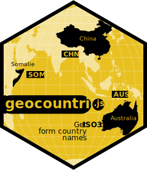
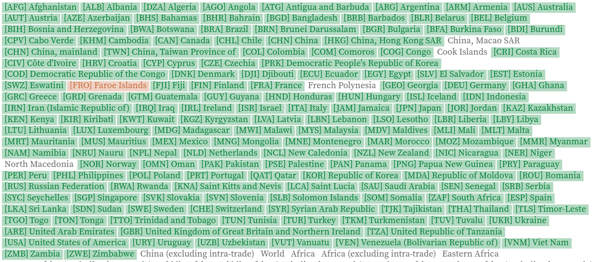

*A tool to get ISO codes and geometries from country names*

## Installation

#### <ins>In browser</ins>

```html
<script src="https://cdn.jsdelivr.net/npm/geocountries@1.2" charset="utf-8"></script>
```

#### <ins>In Observable</ins>

~~~js
geocountries = require("geocountries@1.2")
~~~

## Documentation

Domumentation and running examples available [here](https://observablehq.com/@neocartocnrs/geocountries).

## Features

#### <ins>getcode</ins>

To get an ISO3 code from a country name.

~~~js
geocountries.getcode("United States of America")
~~~

returns an object

~~~js
{name: "United States of America", iso3: "USA", score: 1}
~~~

#### <ins>iso3</ins>

To get ISO3 codes from a json data set.

~~~js
codes = geocountries.iso3({
  json: fao,
  name: "Area",
  threshold: 0.7
})
~~~

returns a Map

~~~js
{
  "Afghanistan" => Object {name: "Afghanistan", iso3: "AFG", score: 1}
  "Albania" => Object {name: "Albania", iso3: "ALB", score: 1}
  "Algeria" => Object {name: "Algeria", iso3: "DZA", score: 1}
}
~~~

#### <ins>view</ins>

To visualize the matching of codes and names.

~~~js
geocountries.view(codes)
~~~

returns a svg chart



#### <ins>add</ins>

To add the codes to the initial dataset

~~~js
data = geocountries.add({ data: mydata, codes: codes, name: "Area" })
~~~

#### <ins>addiso3</ins>

If you know your dataset well and you don't need to investigate it, you can skip all the previous steps and add directly the iso3 codes.

~~~js
geocountries.addiso3({
  data: mydata,
  name: "Area",
  treashold: 0.9,
  patch: [
    { name: "French Polynesia", iso3: "PYF" },
    { name: "Niue", iso3: "NIU" },
    { name: "Cook Islands", iso3: "COK" },
    { name: "China, Macao SAR", iso3: "MAC" },
    { name: "Southern Africa", iso3: undefined },
    { name: "South America", iso3: undefined }
  ]
})
~~~
