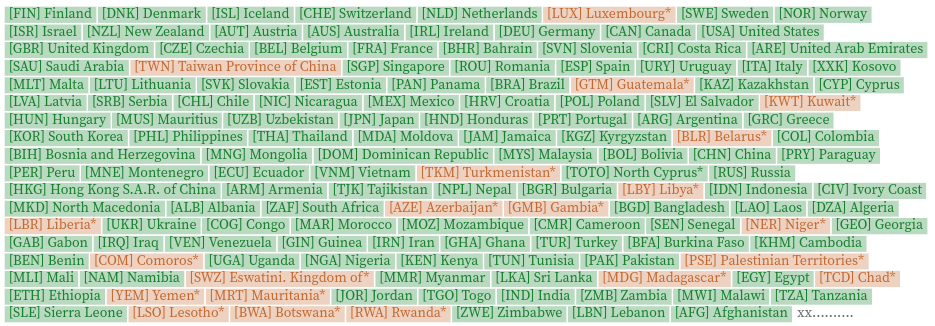

*A tool to get ISO codes and geometries from country names*

## Installation

#### <ins>In browser</ins>

```html
<script src="https://cdn.jsdelivr.net/npm/geocountries@2" charset="utf-8"></script>
```

#### <ins>In Observable</ins>

~~~js
geocountries = require("geocountries@2")
~~~

## Documentation

Domumentation and running examples available [here](https://observablehq.com/@neocartocnrs/geocountries).

## Features

#### <ins>getcode</ins>

To get an ISO3 code from a country name.

~~~js
geocountries.getcode("United States of America")
~~~

returns an object

~~~js
{name: "United States of America", iso3: "USA", score: 1}
~~~

#### <ins>view</ins>

To visualize the matching of codes and names.

~~~js
geocountries.view({
  json: mydata, // a geojson
  name: "name", // filed with country names
  threshold: 0.9, // level of similarity
})
~~~

returns a svg chart



#### <ins>add</ins>

If you know your dataset well and you don't need to investigate it, you can skip all the previous steps and add directly the iso3 codes.

~~~js
geocountries.add({
  json: mydata, // a geojson
  name: "name",  // filed with country names
  threshold: 0.9, // level of similarity
})
~~~

returns a new json with ISO3 codes and scores

#### <ins>Patches</ins>

Note tha you can add a patch to add or remove codes.

~~~js
geocountries.add({
  json: mydata, // a geojson
  name: "name",  // filed with country names
  threshold: 0.9, // level of similarity
  patch: [
    { name: "French Polynesia", iso3: "PYF" },
    { name: "Niue", iso3: "NIU" },
    { name: "Cook Islands", iso3: "COK" },
    { name: "China, Macao SAR", iso3: "MAC" },
    { name: "Southern Africa", iso3: undefined },
    { name: "South America", iso3: undefined }
  ]
})
~~~

#### <ins>Duplicate</ins>

A simple function to get duplicate codes 

~~~js
geocountries.duplicate({ json: data, field: "name" })
~~~
